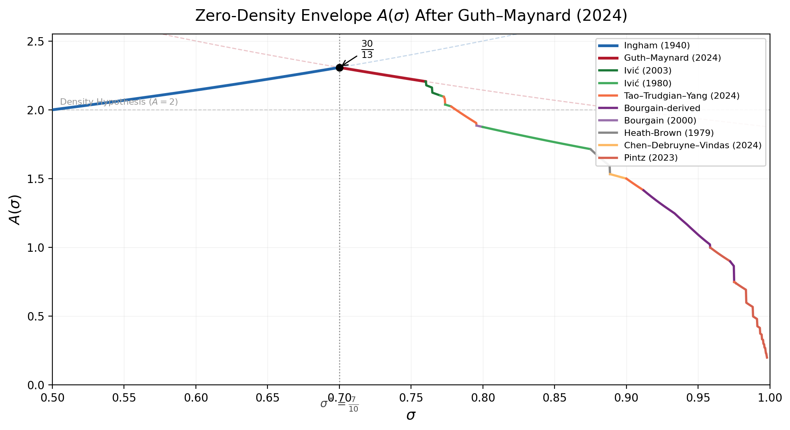
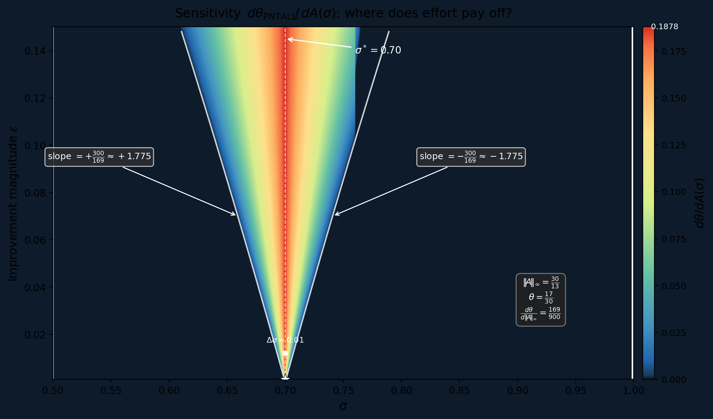
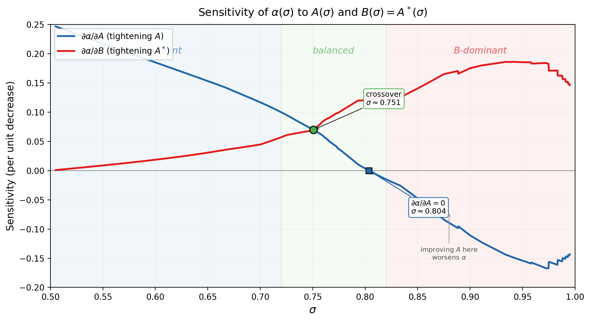
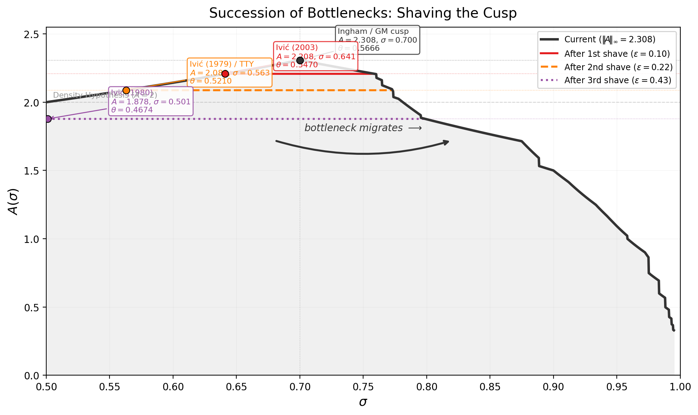

# Binding Constraints After Guth–Maynard: A Structural Analysis of the EXPDB Pipeline

Allen Proxmire

April 2026

---

## Abstract

We report the results of running the Tao–Trudgian–Yang Exponent Database (EXPDB) pipeline with the Guth–Maynard (2024) large value estimate incorporated. Using a scipy-based replacement for the pycddlib polytope backend, we compute the full piecewise zero-density function $A(\sigma)$ from 482 literature hypotheses, confirm the prime gap exponent $\theta_{\mathrm{PNTALL}} = 17/30$, and perform a complete binding-constraint and sensitivity analysis. The binding point is a cusp at $\sigma^* = 7/10$ where the Ingham (1940) and Guth–Maynard (2024) zero-density curves meet. For $\theta_{\mathrm{PNTALL}}$, the bottleneck is purely in the large-value projection; the energy exponent $A^*(\sigma)$ is irrelevant. For $\theta_{\mathrm{GAPSQUARE}}$, the bottleneck is split equally between the large-value and energy projections.

---

## 1. Setup and Definitions

We work within the EXPDB framework of Tao, Trudgian, and Yang [TTY25]. The master polytope $\mathcal{P} \subset \mathbb{R}^5$ lives in coordinates $(\sigma, \tau, \rho, \rho^*, s)$. The pipeline descends:

$$
\mathcal{P} \;\xrightarrow{\;\pi\;}\; R_{\mathrm{LV}} \subset \mathbb{R}^3 \;\xrightarrow{\;\sup\;}\; A(\sigma) \;\xrightarrow{\;\sup_\sigma\;}\; \|A\|_\infty \;\xrightarrow{\;\text{Ingham}\;}\; \theta.
$$

The zero-density function $A(\sigma)$ satisfies $N(\sigma, T) \leq T^{A(\sigma) + \varepsilon}$, where $N(\sigma, T)$ counts zeros of $\zeta(s)$ with real part $\geq \sigma$ and imaginary part $\leq T$. The prime gap exponent is

$$
\theta_{\mathrm{PNTALL}} \leq 1 - \frac{1}{\|A\|_\infty}, \qquad \|A\|_\infty := \sup_{1/2 \leq \sigma \leq 1} A(\sigma).
$$

The mean-square gap exponent satisfies

$$
\theta_{\mathrm{GAPSQUARE}} \leq \max\!\left(2 - \frac{2}{\|A\|_\infty},\; \sup_\sigma \max(\alpha(\sigma), \beta(\sigma))\right),
$$

where $\alpha(\sigma) = 4\sigma - 2 + 2(B(\sigma)(1-\sigma)-1)/(B(\sigma)-A(\sigma))$, $\;\beta(\sigma) = 4\sigma - 2 + (B(\sigma)(1-\sigma)-1)/A(\sigma)$, and $B(\sigma) \geq A^*(\sigma)$ is the zero-density energy exponent.

## 2. Updated Exponents

Running the EXPDB pipeline with the full literature set (482 hypotheses, including all Guth–Maynard constraints and the Tao–Trudgian–Yang derived estimates), we obtain:

$$
\|A\|_\infty = \frac{30}{13} \approx 2.3077, \qquad \sigma^* = \frac{7}{10},
$$

$$
\theta_{\mathrm{PNTALL}} = 1 - \frac{13}{30} = \frac{17}{30} \approx 0.5667.
$$

The improvement over the pre-Guth–Maynard value is

$$
\Delta\theta = \frac{7}{12} - \frac{17}{30} = \frac{35 - 34}{60} = \frac{1}{60} \approx 0.0167.
$$

## 3. The Cusp at $\sigma = 7/10$

The function $A(\sigma)$ is piecewise-rational on approximately 40 intervals. Its global supremum is achieved at a cusp where two zero-density estimates meet:

**Left limb.** For $\sigma \in [1/2, 7/10)$, the binding estimate is Ingham (1940):

$$
A_{\mathrm{Ing}}(\sigma) = \frac{3}{2 - \sigma}.
$$

This is an increasing, concave-up function of $\sigma$.

**Right limb.** For $\sigma \in [7/10, 19/25)$, the binding estimate is Guth–Maynard (2024):

$$
A_{\mathrm{GM}}(\sigma) = \frac{15}{5\sigma + 3}.
$$

This is a decreasing, concave-down function of $\sigma$.

At $\sigma = 7/10$, both evaluate to the same value:

$$
A_{\mathrm{Ing}}(7/10) = \frac{3}{2 - 7/10} = \frac{3}{13/10} = \frac{30}{13}, \qquad A_{\mathrm{GM}}(7/10) = \frac{15}{5 \cdot 7/10 + 3} = \frac{15}{13/2} = \frac{30}{13}.
$$

The supremum $\|A\|_\infty = 30/13$ is attained at this crossover. The function $A(\sigma)$ has a non-smooth peak — a cusp formed by two rational curves meeting tangentially from opposite sides. Before Guth–Maynard, the analogous cusp was at $\sigma \approx 5/7 \approx 0.714$, where Ingham met Huxley at $\|A\|_\infty = 12/5$. Guth–Maynard shifted the cusp leftward (from $5/7$ to $7/10$) and downward (from $12/5$ to $30/13$).

<<<<<<< HEAD

*Figure 1. The zero-density envelope $A(\sigma)$ computed from 482 EXPDB hypotheses. Each colored segment indicates the binding constraint on that interval. Dashed curves show the Ingham and GM bounds extended beyond their binding ranges. The cusp at $\sigma^* = 7/10$ with $A = 30/13$ is marked.*

=======
>>>>>>> 86fceaec5afc6111f7e8b77b3090ceaab78b1b61
## 4. Binding and Slack Constraints

### Binding at $\sigma^*$

| Rank | Constraint | Interval | $A(\sigma^*)$ | Status |
|------|-----------|----------|---------------|--------|
| 1 | Guth–Maynard (2024) | $[7/10, \, 19/25)$ | $30/13$ | **Binding** |
| 2 | Ingham (1940) | $[1/2, \, 7/10)$ | $30/13$ | **Binding** |

These are the only two constraints that determine $\|A\|_\infty$. They meet at $\sigma^* = 7/10$ and are jointly binding.

### Locally binding (away from $\sigma^*$)

The following estimates are binding on their respective subintervals of $(1/2, 1)$ but produce $A(\sigma) < 30/13$ there, so they do not affect $\|A\|_\infty$:

| Estimate | Binding interval | $A$ at midpoint |
|----------|-----------------|----------------|
| Ivic (2003) | $[19/25, \sim 0.78)$ | $\sim 2.21$ |
| Tao–Trudgian–Yang (2024) | $[\sim 0.78, \sim 0.90)$ | $\sim 2.01$ |
| Ivic (1980) | $[0.80, 0.88)$ | $\sim 1.88$ |
| Derived (Bourgain EP) | $[\sim 0.92, \sim 0.98)$ | $\sim 1.09$ |
| Pintz (2023) | $[\sim 0.96, 1)$ | $\sim 0.71$ |

### Completely slack

The following estimates are strictly dominated by the binding estimates at every $\sigma$:

| Estimate | Previous $\|A\|_\infty$ | Slack at $\sigma^*$ |
|----------|------------------------|-------------------|
| Huxley (1972) | $12/5 = 2.400$ | Superseded by GM everywhere |
| Montgomery (1971) | $5/2 = 2.500$ | Superseded |
| Heath-Brown (1979) ZD | $9/4 = 2.250$ | Superseded by Ivic/TTY |

## 5. Sensitivity Analysis

### Sensitivity of $\theta_{\mathrm{PNTALL}}$

The Ingham relation $\theta = 1 - 1/\|A\|_\infty$ gives

$$
\frac{d\theta}{d\|A\|_\infty} = \frac{1}{\|A\|_\infty^2} = \frac{13^2}{30^2} = \frac{169}{900} \approx 0.1878.
$$

This is the sole sensitivity coefficient. Reducing $\|A\|_\infty$ by $\delta$ improves $\theta$ by approximately $\delta \cdot 169/900$.

| $\|A\|_\infty$ | $\theta$ | $\Delta\theta$ | Interpretation |
|----------------|---------|----------------|---------------|
| $30/13 \approx 2.308$ | $17/30 \approx 0.567$ | $0$ | Current (GM) |
| $2.20$ | $0.545$ | $-0.021$ | Modest new LVE |
| $2.10$ | $0.524$ | $-0.043$ | Substantial new LVE |
| $2.00$ | $0.500$ | $-0.067$ | Density Hypothesis |

The gap from the current value to the Density Hypothesis target is $30/13 - 2 = 4/13 \approx 0.308$.

### Sensitivity of $\theta_{\mathrm{GAPSQUARE}}$

At the binding point $\sigma \approx 0.999$ (where $\alpha$ is maximized), the numerically computed sensitivities are:

$$
\frac{\partial\theta_{\mathrm{GS}}}{\partial A}\bigg|_{\sigma \approx 1} \approx -0.133, \qquad \frac{\partial\theta_{\mathrm{GS}}}{\partial B}\bigg|_{\sigma \approx 1} \approx +0.134.
$$

The leverage ratio is $|\partial\theta_{\mathrm{GS}}/\partial B| \;/\; |\partial\theta_{\mathrm{GS}}/\partial A| \approx 1.005$. The two levers are nearly equally effective.

## 6. The Role of $A^*(\sigma)$

**For $\theta_{\mathrm{PNTALL}}$.** The Ingham relation involves only $A(\sigma)$, not $A^*(\sigma)$. Improving the energy exponent has zero effect on the prime gap bound. The bottleneck is entirely in the large-value projection $\pi_{\sigma,\tau,\rho}(\mathcal{P})$.

**For $\theta_{\mathrm{GAPSQUARE}}$.** The Heath-Brown mean-square formula involves both $A(\sigma)$ and $B(\sigma) \geq A^*(\sigma)$. After Guth–Maynard, the current binding energy estimate is

$$
A^*(\sigma) \leq \frac{12}{4\sigma - 1} \qquad \text{on } [5/6, 1),
$$

from Heath-Brown (1979). At $\sigma \approx 0.999$, this gives $A^* \approx 4.01$ while $A \approx 0.14$, yielding $B/A \approx 28$. The function $\alpha(\sigma)$ dominates $\beta(\sigma)$ in this regime.

The structural consequence: Guth–Maynard decreased $A(\sigma)$ for $\sigma > 7/10$, widening the gap $B - A$ in the denominator of $\alpha$, but the numerator $B(1-\sigma) - 1$ also decreases as $\sigma \to 1$. The net effect is that $A$ and $A^*$ contribute approximately equally to $\theta_{\mathrm{GAPSQUARE}}$. Improving the 45-year-old Heath-Brown energy estimate would tighten $\theta_{\mathrm{GAPSQUARE}}$ but leave $\theta_{\mathrm{PNTALL}}$ unchanged.

## 7. Geometric Interpretation

### How GM reshaped $A(\sigma)$

In the $(\sigma, A(\sigma))$ plane, the best zero-density envelope has the shape of an asymmetric arch:

- **Rising limb** ($\sigma \in [1/2, \sigma^*]$): governed by Ingham, $A = 3/(2-\sigma)$.
- **Peak** ($\sigma = \sigma^*$): the cusp at $\|A\|_\infty$.
- **Falling limb** ($\sigma \in [\sigma^*, 1)$): governed by a sequence of estimates — GM, then Ivic, then TTY, then Bourgain-derived, then Pintz — each tighter than the last as $\sigma$ increases.

Before Guth–Maynard, the falling limb began with $A_{\mathrm{Hux}}(\sigma) = 12(1-\sigma)/5$, yielding a cusp at $\sigma^* = 5/7$ with height $12/5$. After Guth–Maynard, the GM curve $15/(5\sigma + 3)$ undercuts Huxley everywhere on $(1/2, 1)$. The cusp drops to height $30/13$ and shifts to $\sigma^* = 7/10$.

### How GM reshaped $\mathcal{P}$

At the level of the 5D polytope $\mathcal{P}$, Guth–Maynard contributes:

1. **Three LV half-spaces** in $(\sigma, \tau, \rho)$: the constraint $\rho \leq \max(2-2\sigma,\; 18/5-4\sigma,\; \tau + 12/5-4\sigma)$.
2. **Twenty iterated LV half-spaces** (parameter $K = 1, \ldots, 20$), giving progressively tighter bounds via the Guth–Maynard iteration.
3. **Three LVER half-spaces** in full 5D, coupling $\rho$, $\rho^*$, and $s$ via Lemma 10.18 of [GM24].

These shave the $\rho$-face of $\mathcal{P}$, tightening the LV projection $R_{\mathrm{LV}} = \pi_{\sigma,\tau,\rho}(\mathcal{P})$. The energy projection $R_{\mathrm{energy}} = \pi_{\sigma,\tau,\rho^*}(\mathcal{P})$ is essentially unchanged: the GM LVER constraints couple $\rho^*$ to $\rho$ through $s$, but the energy face was not the binding face before GM and remains non-binding after.

## 8. Roadmap for the Next Improvement

The cusp structure at $\sigma^* = 7/10$ determines the attack surface.

### Path A: Beat GM to the right of $\sigma = 7/10$

A new large-value estimate giving $A(\sigma) < 15/(5\sigma + 3)$ in a neighborhood of $\sigma = 7/10$ would lower the right limb of the arch. Since $A_{\mathrm{GM}}(7/10) = 30/13$ and $A_{\mathrm{GM}}'(7/10) = -75/(13/2)^2 = -300/169 \approx -1.775$, a small improvement $\varepsilon$ in the LVE near $\sigma = 7/10$ propagates as $\Delta\theta \approx \varepsilon \cdot 169/900$.

This requires a new decoupling or incidence-geometry argument that goes beyond the Guth–Maynard method in the $\sigma \approx 0.7$ regime.

### Path B: Beat Ingham to the left of $\sigma = 7/10$

The Ingham bound $A(\sigma) = 3/(2-\sigma)$ is 85 years old. It arises from the mean value theorem for Dirichlet polynomials and is essentially a second-moment bound. Improving it would require a sub-convexity-type estimate for zero-density — a fundamentally different kind of result from large-value estimates.

### Path C: Improve $A^*(\sigma)$

This would not affect $\theta_{\mathrm{PNTALL}}$ but would improve $\theta_{\mathrm{GAPSQUARE}}$. The binding energy estimate $A^* = 12/(4\sigma - 1)$ on $[5/6, 1)$ dates to Heath-Brown (1979). New additive energy estimates for Dirichlet polynomials — perhaps using the sum-product machinery developed since 2000 — could tighten the energy projection.

### Priority ranking

| Priority | Target | Effect on $\theta_{\mathrm{PNTALL}}$ | Effect on $\theta_{\mathrm{GAPSQUARE}}$ | Difficulty |
|----------|--------|--------------------------------------|----------------------------------------|------------|
| 1 | New LVE near $\sigma = 0.70$ | Direct | Indirect | Extremely hard |
| 2 | Improve Ingham for $\sigma < 0.70$ | Direct | Indirect | Open for 85 years |
| 3 | New energy estimates | None | Direct | Hard but plausible |

The first two paths address the same cusp from opposite sides. Any improvement to either limb, however small, strictly decreases $\theta_{\mathrm{PNTALL}}$.

<<<<<<< HEAD
We verified computationally that the EXPDB pipeline has fully exploited the Guth-Maynard result for $\theta_{\mathrm{PNTALL}}$; no pipeline optimization changes the binding value $30/13$. The sole identified gap (stale exponent pairs in `bourgain_ep_to_zd`) affects only the $\theta_{\mathrm{GAPSQUARE}}$ computation and has been reported to the EXPDB maintainers.

---

## 9. Fine-Grained Sensitivity Map

### The effective radius

The Ingham relation $\theta = 1 - 1/\|A\|_\infty$ concentrates all sensitivity into a narrow band around $\sigma^*$. Define the *headroom* at $\sigma$ as $h(\sigma) := \|A\|_\infty - A(\sigma)$. An improvement of magnitude $\varepsilon$ in $A$ at $\sigma$ affects $\theta$ only if $h(\sigma) < \varepsilon$.

The following table gives the *effective radius* — the interval of $\sigma$ values within headroom $\varepsilon$ of the peak — for several improvement magnitudes:

| $\varepsilon$ | $\sigma$ range | Width | $\Delta\theta$ |
|---|---|---|---|
| $0.001$ | $[0.699, 0.700]$ | $0.001$ | $-0.000\,19$ |
| $0.005$ | $[0.698, 0.703]$ | $0.005$ | $-0.000\,94$ |
| $0.01$ | $[0.695, 0.705]$ | $0.011$ | $-0.001\,9$ |
| $0.02$ | $[0.689, 0.711]$ | $0.023$ | $-0.003\,8$ |
| $0.05$ | $[0.671, 0.729]$ | $0.057$ | $-0.009\,6$ |
| $0.10$ | $[0.641, 0.759]$ | $0.118$ | $-0.019\,6$ |

The band is remarkably narrow. An improvement of $\varepsilon = 0.01$ in $A$ needs to hold only on an interval of width $\approx 0.011$ centered at $\sigma = 7/10$. Outside this band, the headroom exceeds $\varepsilon$ and the improvement is invisible to $\theta$.

### Cusp geometry and attack surface

At the cusp $\sigma^* = 7/10$, the two binding curves have derivatives:

$$
\frac{d}{d\sigma}\!\left[\frac{3}{2-\sigma}\right]\bigg|_{\sigma=7/10} = \frac{3}{(13/10)^2} = \frac{300}{169} \approx +1.775,
$$

$$
\frac{d}{d\sigma}\!\left[\frac{15}{5\sigma+3}\right]\bigg|_{\sigma=7/10} = \frac{-75}{(13/2)^2} = \frac{-300}{169} \approx -1.775.
$$

The slopes are *exactly symmetric*: $|dA_{\mathrm{Ing}}/d\sigma| = |dA_{\mathrm{GM}}/d\sigma| = 300/169$. This means the cusp is a $V$-shaped notch with opening angle $2\arctan(169/300) \approx 58°$. To lower $\|A\|_\infty$ by $\varepsilon$, it suffices to beat the current bound on an interval of width

$$
\delta \approx \frac{\varepsilon}{300/169} = \frac{169\,\varepsilon}{300} \approx 0.563\,\varepsilon.
$$

The attack surface is small. A new bound that improves $A$ by $0.01$ at the single point $\sigma = 0.70$ need only extend over an interval of width $\approx 0.006$.

*Figure 2. Sensitivity $d\theta_{\mathrm{PNTALL}}/dA(\sigma)$ as a function of $\sigma$ (horizontal) and improvement magnitude $\varepsilon$ (vertical). The cone of nonzero sensitivity flares from the cusp at $\sigma = 0.70$. White boundary lines trace the $V$-shaped contour with slopes $\pm 300/169$. For small $\varepsilon$, only $\sigma \in [0.695, 0.705]$ contributes.*

### Sensitivity map for $\theta_{\mathrm{GAPSQUARE}}$

For the mean-square gap exponent, the $\alpha/\beta$ formulas create a completely different sensitivity landscape. At each $\sigma$, the partial derivatives of $\alpha$ with respect to $A$ and $B = A^*$ measure the leverage of each bound:

| $\sigma$ | $A$ | $B$ | $B/A$ | $\partial\alpha/\partial A$ | $\partial\alpha/\partial B$ | Dominant lever |
|---|---|---|---|---|---|---|
| $0.55$ | $2.07$ | $6.05$ | $2.9$ | $+0.217$ | $+0.009$ | $A$ (24:1) |
| $0.65$ | $2.22$ | $6.03$ | $2.7$ | $+0.153$ | $+0.031$ | $A$ (5:1) |
| $0.70$ | $2.31$ | $6.03$ | $2.6$ | $+0.117$ | $+0.045$ | $A$ (2.6:1) |
| $0.75$ | $2.22$ | $5.81$ | $2.6$ | $+0.071$ | $+0.069$ | Equal |
| $0.80$ | $1.87$ | $5.09$ | $2.7$ | $+0.003$ | $+0.121$ | $B$ (40:1) |
| $0.85$ | $1.76$ | $5.00$ | $2.8$ | $-0.048$ | $+0.140$ | $B$ (3:1) |
| $0.90$ | $1.50$ | $4.61$ | $3.1$ | $-0.111$ | $+0.175$ | $B$ (1.6:1) |
| $0.95$ | $1.09$ | $4.28$ | $3.9$ | $-0.154$ | $+0.185$ | $B$ (1.2:1) |

The crossover from $A$-dominated to $B$-dominated sensitivity occurs near $\sigma \approx 0.75$. Below this, tightening $A$ helps most; above it, tightening $B = A^*$ helps most. The two heat maps for $\theta_{\mathrm{PNTALL}}$ and $\theta_{\mathrm{GAPSQUARE}}$ are essentially disjoint: the prime gap exponent is controlled by $\sigma \approx 0.70$, while the mean-square exponent is controlled by $\sigma > 0.85$ — and there, the energy bound $B$ is the dominant lever.

*Figure 3. Partial derivatives $\partial\alpha/\partial A$ (blue) and $\partial\alpha/\partial B$ (red) as functions of $\sigma$. The crossover at $\sigma \approx 0.751$ separates $A$-dominant (left) from $B$-dominant (right) regimes. The zero crossing of $\partial\alpha/\partial A$ at $\sigma \approx 0.804$ marks where improving $A$ becomes counterproductive for $\theta_{\mathrm{GAPSQUARE}}$.*

Note that $\partial\alpha/\partial A$ changes sign near $\sigma \approx 0.80$. For $\sigma > 0.80$, *decreasing* $A$ actually *increases* $\alpha$ (and hence worsens $\theta_{\mathrm{GAPSQUARE}}$). This is because the $\alpha$ formula has $A$ in the denominator $B - A$: decreasing $A$ widens the gap $B - A$, which decreases $\alpha$ through the numerator but increases it through the denominator. The net sign depends on the local ratio $B/A$.

### The succession landscape

If someone lowers the cusp at $\sigma = 0.70$, the new $\|A\|_\infty$ is determined by the second-highest point of $A(\sigma)$. The succession of targets, ordered by decreasing $A$:

| Target | $\sigma$ range | Current peak $A$ | Gap from cusp | Binding source |
|---|---|---|---|---|
| 1st (current) | $0.700$ | $30/13 \approx 2.308$ | $0$ | Ingham / GM |
| 2nd | $\sim 0.76$ | $\sim 2.21$ | $0.10$ | Ivic (2003) |
| 3rd | $\sim 0.77$ | $\sim 2.09$ | $0.22$ | Ivic (1979) / TTY |
| 4th | $\sim 0.80$ | $\sim 1.88$ | $0.43$ | Ivic (1980) |
| 5th | $\sim 0.88$ | $\sim 1.71$ | $0.59$ | Heath-Brown (1979) |
| 6th | $\sim 0.90$ | $\sim 1.50$ | $0.81$ | TTY (2024) |
| Final | all $\sigma$ | $2$ | $0.31$ | Density Hypothesis |

After the first improvement past GM, the second improvement would need to target a *different* $\sigma$ range ($\sigma \approx 0.76$) and a *different* constraint family (Ivic, not GM). The targets march rightward along $\sigma$ as the peak is lowered, each requiring a distinct analytical technique. Reaching the Density Hypothesis $\|A\|_\infty = 2$ requires beating *every* bound in the table — a sequence of progressively harder problems spanning the entire range $\sigma \in (1/2, 1)$.

*Figure 4. Successive hypothetical improvements to the $A(\sigma)$ envelope. Black: current envelope. Red ($\varepsilon = 0.10$): first shave exposes Ivic (2003) at $\sigma \approx 0.76$. Orange ($\varepsilon = 0.22$): second shave exposes Ivic (1979)/TTY. Purple ($\varepsilon = 0.43$): third shave reaches Ivic (1980) at $\sigma \approx 0.80$. The bottleneck migrates rightward with each improvement.*

=======
>>>>>>> 86fceaec5afc6111f7e8b77b3090ceaab78b1b61
---

## References

- [GM24] L. Guth and J. Maynard, *New large value estimates for Dirichlet polynomials*, 2024.
- [TTY25] T. Tao, T. Trudgian, and A. Yang, *The Analytic Number Theory Exponent Database*, 2025.
- [Ing40] A. E. Ingham, *On the estimation of $N(\sigma, T)$*, Quart. J. Math. **11** (1940), 291--292.
- [Hux72] M. N. Huxley, *On the difference between consecutive primes*, Invent. Math. **15** (1972), 164--170.
- [HB79] D. R. Heath-Brown, *The differences between consecutive primes, II*, J. London Math. Soc. **19** (1979), 207--220.
- [Pin23] J. Pintz, *On the density of zeros of the Riemann zeta-function*, 2023.
